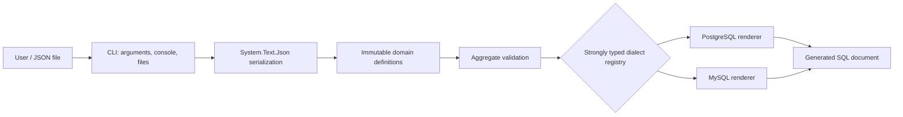

# Architecture

## Boundaries and flow

`SqlScriptGen.Core` has no console or filesystem dependency. It owns domain records, catalogs, validation, serialization, generator registry, and renderers. `SqlScriptGen.Cli` owns process concerns and orchestrates Core.

Columns and constraint column lists are ordered `IReadOnlyList` values. Validation checks identifiers, referential integrity within the definition, type arguments, dialect support, and incompatible options before rendering. Each renderer owns only syntax differences; indentation, comma joining, line endings, and constraint structure are centralized. Adding a dialect requires a catalog and `ISqlDialectRenderer`, then explicit registration—never enum ordinals.

Major decisions: always quote validated identifiers; model raw expressions explicitly; never execute SQL; collect related errors; avoid a CLI framework while the grammar is small; reject unknown JSON fields to catch mistakes; preserve deterministic LF output on all platforms.
