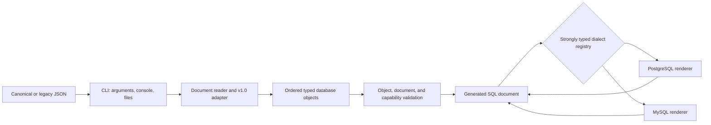

# Architecture

## Boundaries and flow

`SqlScriptGen.Core` has no console or filesystem dependency. It owns domain records, catalogs/capabilities, compatibility and canonical serialization, object/document validation, stable topological ordering, generator registry, and renderers. `SqlScriptGen.Cli` owns process concerns and orchestrates Core.

`SqlDefinitionDocument` contains an ordered `IReadOnlyList<IDatabaseObject>`. Version 1 supports typed tables and databases only and rejects mixed documents. `DatabaseObjectIdentity` compares kind/schema/name with `OrdinalIgnoreCase`, independent of the host OS, while renderers preserve original spelling. Explicit dependencies must resolve internally. Foreign keys add edges only when their targets are in the document; absent targets remain external SQL references. Stable topological sorting uses declaration order as its tie-breaker and never mutates input.

Columns and constraint column lists remain ordered. Validation composes document structure, identity uniqueness, existing object rules, capabilities, dependencies, and cycles before rendering. `GeneratedSqlDocument.Sql` remains the public SQL string and now also carries ordered `GeneratedSqlStatement` metadata. Statements use one blank line between them, LF endings, and one final newline.

Major decisions: always quote validated identifiers; model raw expressions explicitly; never execute SQL; collect related errors; avoid a CLI framework while the grammar is small; reject unknown JSON versions/kinds/fields; preserve deterministic output; and use explicit dialect capabilities instead of implying universal renderer support.
