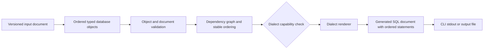

# Post-1.0 architecture review

## Current extension points

- `src/SqlScriptGen.Core/Models.cs`: immutable records and ordered `IReadOnlyList` collections; `TableConstraint` already uses `System.Text.Json` polymorphism. `SqlExpression` explicitly distinguishes raw expressions from names.
- `src/SqlScriptGen.Core/Rendering.cs`: `ISqlDialectRenderer.Dialect` and `SqlGenerator` use strongly typed keyed dispatch; `PostgreSqlRenderer` and `MySqlRenderer` isolate syntax.
- `src/SqlScriptGen.Core/Catalogs.cs`: per-dialect type catalogs provide a precedent for capability-specific metadata.
- `src/SqlScriptGen.Core/Validation.cs`: `ValidationResult` collects errors rather than failing at the first problem.
- `src/SqlScriptGen.Cli/Program.cs`: testable orchestration separates console/files from Core and has stable failure codes.
- `tests/`: exact-output, validation, serialization, and CLI tests establish deterministic contracts.

## Constraints and evidence

1. **One-table root:** `DefinitionJson.Deserialize` returns only `TableDefinition`; examples contain one table.
2. **No statement collection:** `GeneratedSqlDocument` wraps one `Sql` string with no statement metadata or ordered parts.
3. **No project document:** there is no model for several objects, document version, or document-wide settings.
4. **Constraints are independent records:** `TableConstraint` is separate from `ColumnDefinition`, which is reusable, but every constraint remains owned by one `TableDefinition`.
5. **Names are strings:** schema/table/column components are repeatedly represented as `string`; there is no reusable qualified object identity.
6. **Table-specialized renderers:** `ISqlDialectRenderer` exposes only `RenderCreateTable` and `RenderCreateDatabase`.
7. **Table-specialized validation:** `SqlDefinitionValidator.Validate(TableDefinition, DatabaseDialect)` contains all orchestration in one method.
8. **Polymorphism exists locally:** `TableConstraint` uses `JsonPolymorphic`; the root document does not.
9. **No dependencies:** foreign keys carry referenced names but cannot declare or resolve general object dependencies.
10. **Local determinism only:** column/constraint order and LF formatting are deterministic; cross-object ordering does not exist.
11. **Naming is partly centralized:** identifier syntax is centralized in `ValidateIdentifier`, and quoting in `SqlDialectRenderer.Quote`, but qualified names and dialect length rules are not first-class.
12. **Raw expressions are explicit:** `SqlExpression` marks defaults/checks, but there is no separate string-literal or procedural-body type.

## Required foundation

Introduce a versioned document envelope containing an ordered collection of typed database objects. A common abstraction should carry stable object identity and declared dependencies—not arbitrary SQL. Keep object-specific records and validators. Add a stable qualified-name value type, document-level validation orchestration, dependency graph diagnostics, stable topological ordering with declaration-order tie-breaking, renderer capability discovery, and ordered statement output.

## Compatibility and JSON versioning

Version 1.1 should accept both the unversioned v1.0 single-table shape and a new envelope such as `{ "formatVersion": 1, "objects": [...] }`. Legacy input is an adapter into the new domain, not a second generator. Serialization should emit only the canonical envelope when explicitly requested; existing CLI generation must remain byte-for-byte compatible. Reject unknown future major format versions with a useful error. Removing the legacy adapter or changing command/output contracts requires a 2.0 decision.

## Testing and documentation implications

Add schema/serialization fixtures for both formats, object-polymorphism round trips, ordered multi-statement golden files for both dialects, graph cycle/missing-dependency/stable-tie tests, capability rejection tests, and CLI compatibility tests. Every later object type needs model, validation, renderer, exact-output, JSON schema/example, user-guide, architecture, and dialect-support updates.

## Dialect and security risks

Do not make interface membership imply universal support. Model capabilities explicitly and reject unsupported object/options before rendering. PostgreSQL schemas/sequences/functions and MySQL database/schema terminology, prefixes, delimiters, and routines must remain dialect-owned. Continue to separate `SqlExpression`; add distinct escaped SQL string literals and explicit raw query/procedural body wrappers. Never execute output, embed credentials, or introduce connectivity without a separately approved design and threat review.

## Decisions required before implementation

The accompanying ADRs propose: a versioned envelope with a compatibility adapter; a narrow database-object abstraction; stable topological ordering; explicit raw-expression/body boundaries; and a dialect capability model. These decisions should be accepted or revised before v1.1 production code begins.
